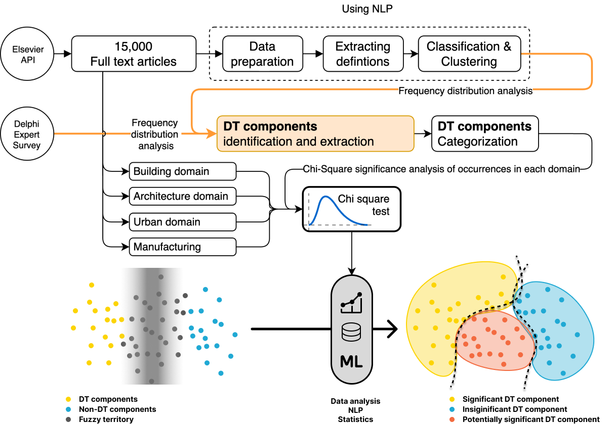

# What is a Digital Twin Anyway? Deriving the Definition for the Built Environment from Over 15,000 Scientific Publications

## Authors

- Mahmoud Abdelrahman  
  - Department of Architecture, National University of Singapore, Singapore.  
- Edgardo Macatulad
  - Department of Architecture, National University of Singapore, Singapore. 
  - Department of Geodetic Engineering, University of the Philippines, Philippines.  
- Binyu Lei  
  - Department of Architecture, National University of Singapore, Singapore. 
- Matias Quintana  
  - Future Cities Lab Global Programme, Singapore-ETH Centre, Singapore. 
- Clayton Miller  
  - Department of the Built Environment, National University of Singapore, Singapore.  
- Filip Biljecki
  - Department of Architecture, National University of Singapore, Singapore.  
  - Department of Real Estate, National University of Singapore, Singapore.

---

## Abstract

The concept of Digital Twins (DT) has attracted significant attention across various domains, particularly within the built environment. However, there is a sheer volume of definitions and the terminological consensus remains out of reach. The lack of a universally accepted definition leads to ambiguities in their conceptualization and implementation, and may cause miscommunication for both researchers and practitioners. 

We employed Natural Language Processing (NLP) techniques to systematically extract and analyze definitions of DTs from a corpus of more than 15,000 full-text articles spanning diverse disciplines. The study compares these findings with insights from an expert survey that included 52 experts. The study identifies concurrence on the components that comprise a ``Digital Twin'' from a practical perspective across various domains, contrasting them with those that do not, to identify deviations. We investigate the evolution of digital twin definitions over time and across different scales, including manufacturing, building, and urban/geospatial perspectives. 
We extracted the main components of Digital Twins using Text Frequency Analysis and N-gram analysis. 
Subsequently, we identified components that appeared in the literature and conducted a Chi-square test to assess the significance of each component in different domains. 

Our analysis identified key components of digital twins and revealed significant variations in definitions based on application domains, such as manufacturing, building, and urban contexts. The analysis of DT components reveal two major groups of DT types: High-Performance Real-Time (HPRT) DTs, and Long-Term Decision Support (LTDS) DTs. Contrary to common assumptions, we found that components such as simulation, AI/ML, real-time capabilities, and bi-directional data flow are not yet fully mature in the digital twins of the built environment. We derived two definitions for the Building/Architecture DT and the City/Urban DTs. Both definitions have a must-have components (such as spatial and temporal data updates) and good-to-have components such as prediction, AI, bi-directional data flow, and Real-time data exchange. 

One of the key findings is that the definition of digital twins has not yet reached its equilibrium phase, highlighting the need for ongoing revisions as technologies emerge or existing ones become obsolete. To address this, we introduce a novel, reproducible methodology that enables researchers to refine and adapt the current definitions in response to technological advancements or deprecations.

## Key Features

- **Systematic Review**: NLP-based analysis of over 15,000 articles.  
- **Domain-Specific Insights**: Definitions and components across Building, Architecture, and Urban Digital Twins.  
- **Reproducible Analysis**: Code and data are structured for reuse and verification.

---

## Repository Structure

```plaintext
.
├── README.md                # Project overview and instructions
├── data/                    # Datasets used in the study
├── scripts/                 # Python scripts for data analysis
├── results/                 # Output files and analysis results
├── manuscript/              # Manuscript and related documents
├── notebooks/               # Jupyter notebooks for analysis
├── docs/                    # Additional documentation
```

---
## How to Cite

If you reference this work, please use the following BibTeX citation:

```bibtex
@article{abdelrahman2025digitaltwin,
  title     = {What is a Digital Twin Anyway? Deriving the Definition for the Built Environment from Over 15,000 Scientific Publications},
  author    = {Abdelrahman, Mahmoud and Macatulad, Edgardo and Lei, Binyu and Quintana, Matias and Miller, Clayton and Biljecki, Filip},
  journal   = {Building and Environment},
  year      = {2025},
  volume    = {TBD},
  number    = {TBD},
  pages     = {112748},
  doi       = {10.1016/j.buildenv.2025.112748}
}
```

---

## Contact

For questions or collaboration, please contact:  
**Mahmoud Abdelrahman**  
Email: [mahmoud**A**@nus.edu.sg](mailto:mahmoudA@nus.edu.sg)  

**Filip Biljecki**  
Email: [filip@nus.edu.sg](mailto:filip@nus.edu.sg)

